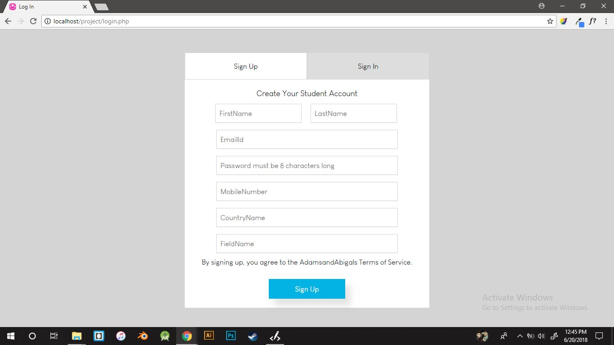
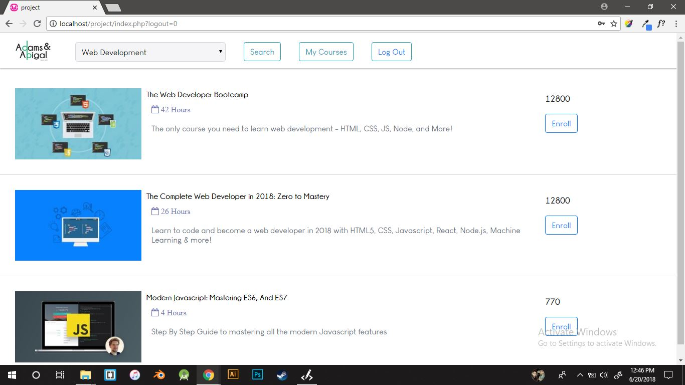
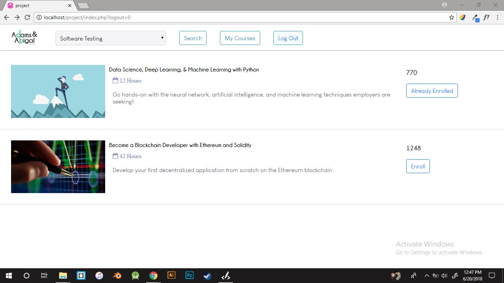
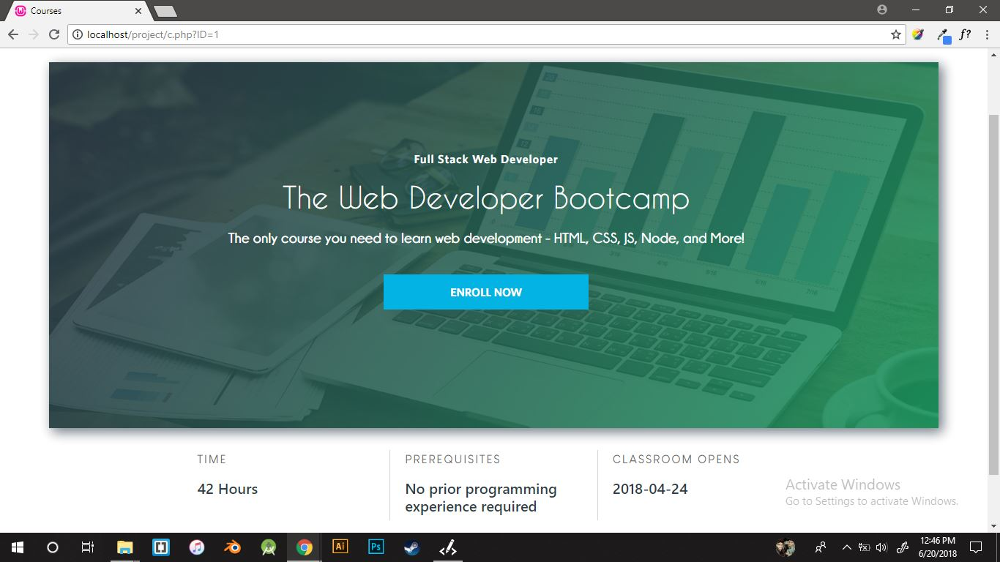

# Course-Selector
Course Selector lets you select and enroll to the courses available on the site.It lets you see the courses in which you are enrolled in .

## Getting Started


Import the project.sql provided in the Sql folder to your Phpmyadmin.
Change the admin name and password wherever necessary for mysql connectivity with php.
If using local server ex.xamp or wamp  put the files in www directory(wamp) or htdocs(xamp)

## Prerequisites
```
Must Have a web Server or a local Server Installed on your system.
```

## Implementation
```
Ajax is used to update the users request Asynchronously.
Php and Mysql is used as Backend.
Bootstrap and Vanilla css is used in Front-end.
```


## Screenshots

### Login and Sign up pages



### Courses





